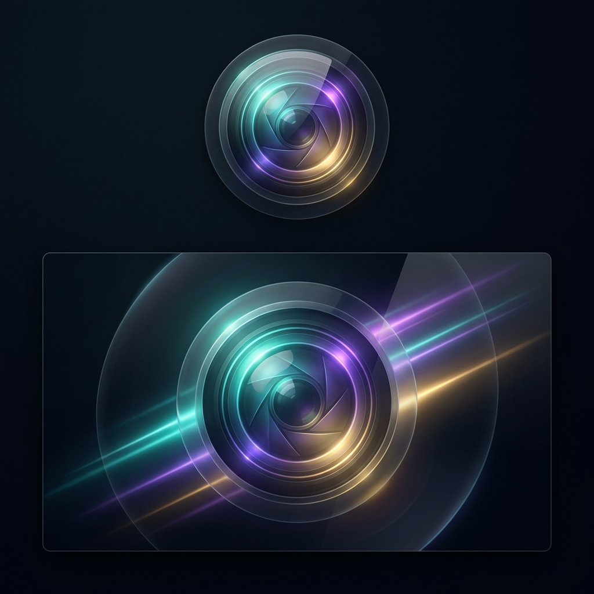

# Loominance 🎥✨



Loominance is a premium, native macOS screen recording application that delivers cinematic, social-ready video clips instantly. By leveraging **Core ML**, it predicts cursor movement and focus zones in real-time, applying professional zoom and pan effects during the recording process—eliminating the need for time-consuming post-processing.

## ✨ Features

- **Real-time Cinematic Zoom**: Core ML-powered cursor prediction for smooth, automatic focus tracking.
- **Instant Export**: Get social-ready clips (16:9, Square, Portrait) immediately after you hit stop.
- **Native macOS Experience**: Built with SwiftUI using `.ultraThinMaterial` for a sleek, modern glassmorphism aesthetic.
- **Privacy-First**: 100% local processing. No telemetry, no cloud, no data leaves your Mac.
- **Optimized for Apple Silicon**: High-performance 60fps recording using hardware-accelerated encoding.

## 🚀 Getting Started

### Prerequisites

- macOS 14.0 or later
- Apple Silicon Mac (M1, M2, M3 series)
- Xcode 15.0+ (for building from source)

### Installation

1. Clone the repository:

   ```bash
   git clone https://github.com/salvadalba/nodaysidle-loominance.git
   ```

2. Open `Loominance.xcodeproj` in Xcode.
3. Select your development team for code signing.
4. Build and Run (Command + R).

## 🛠 Tech Stack

- **UI Framework**: SwiftUI
- **Reactive Logic**: Combine
- **Machine Learning**: Core ML
- **Video Engine**: AVFoundation & VideoToolbox
- **Persistence**: SwiftData
- **Design Language**: Apple Human Interface Guidelines

## 📸 Preview

*The app features a minimalist glassmorphism recording bar and a powerful library manager to track all your cinematic captures.*

---

Created with ❤️ by [salvadalba](https://github.com/salvadalba)
